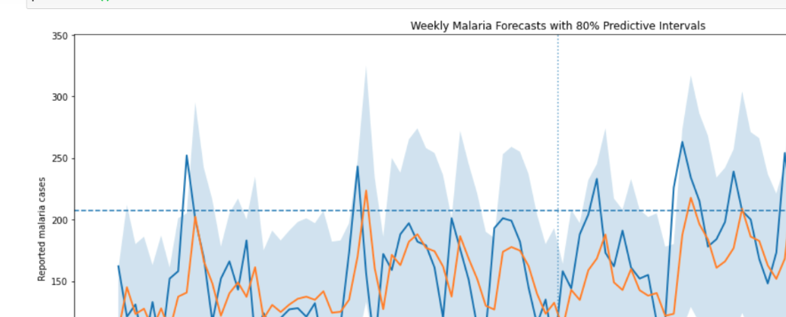

# Malaria Burden Forecasting for Hospital Preparedness

## Peru proof of concept for a future Howard Mission Hospital adaptation

This project began with a local public-health question: **could routinely collected malaria surveillance data be used to give a hospital an early indication of the likely malaria burden in the following week?**

The intended long-term setting is **Howard Mission Hospital in Zimbabwe**. However, sufficiently detailed local historical malaria data were not readily accessible during development. Rather than abandon the idea, I used an available longitudinal malaria surveillance dataset from Peru to build, test, and stress-test the complete forecasting workflow first.

The Peru analysis is therefore a **proof of concept and feasibility study**, not a model that should be used directly for operational decisions in Zimbabwe.

> **Important transferability note:** the fitted Peru model is not directly transferable to Howard Mission Hospital. What is transferable is the workflow: weekly surveillance aggregation, time-based feature engineering, model comparison, out-of-sample validation, uncertainty quantification, and high-burden risk estimation. A Howard-specific model would need local data, retraining, locally defined thresholds, and independent validation.

---

## Why I built this

The original goal was not simply to fit a model to a public dataset. I wanted to explore whether a practical malaria forecasting tool could eventually support preparedness at a local hospital: planning staff time, testing capacity, medicines, and other resources before a high-burden week occurs.

The main challenge was data access. Because I did not initially have a sufficiently long weekly malaria series from the local hospital, I used an external malaria dataset to answer a prior question first:

**Can the modelling framework itself work, and what are its limitations before I try to adapt it locally?**

That decision shaped the project. The focus became not just prediction accuracy, but understanding where the model succeeds, where it fails, and what extra information would be needed before real-world deployment.

---

## Main questions

1. Can recent malaria case history predict next week's reported malaria burden?
2. Does adding rainfall and temperature improve out-of-sample forecasts?
3. Do more complex models outperform a simple statistical count model?
4. Where do the models fail: low, moderate, or high-burden weeks?
5. Can uncertainty intervals provide more useful information than a single point forecast?
6. Can the model estimate the risk that the next week will exceed a historically high-burden threshold?

---

## Data used

### Malaria surveillance data

The analysis used weekly malaria surveillance records from Peru covering **2018-2024**. The cleaned record-level dataset contained **58,234 malaria records** before weekly aggregation.

The target used in modelling was:

**weekly reported malaria case burden**

The project deliberately uses the wording *reported cases* rather than assuming that surveillance counts equal all malaria infections occurring in the community.

### Weather data

Historical hourly temperature and rainfall were obtained from the **Open-Meteo Historical Weather API** for a coordinate in Loreto, Peru.

Hourly timestamps were converted to local time and reconstructed into Sunday-Saturday epidemiological weeks. Weekly temperature was represented by the mean and rainfall by the weekly total.

A major limitation is that weather came from a single coordinate, while malaria records represented a wider area. This may weaken the environmental signal.

---

## Workflow

The project followed a time-aware forecasting workflow:

1. Clean and inspect malaria surveillance records.
2. Aggregate individual records into weekly reported case counts.
3. Reconstruct epidemiological weeks for hourly weather data.
4. Aggregate weather into weekly temperature and rainfall measures.
5. Merge malaria and weather data by year and epidemiological week.
6. Explore trends, annual variation, peaks, and seasonality.
7. Create lagged case and weather features.
8. Split data chronologically rather than randomly.
9. Establish a persistence baseline.
10. Fit Negative Binomial count models.
11. Test weather-augmented forecasting.
12. Compare against Random Forest.
13. Diagnose performance by actual-case quartile.
14. Explore a high-burden warning classifier.
15. Quantify forecast uncertainty with predictive intervals.
16. Estimate the model-implied probability of exceeding a high-burden threshold.

---

## Models tested

| Model | 2023-2024 MAE | 2023-2024 RMSE |
|---|---:|---:|
| Persistence baseline | 32.97 | 41.70 |
| Negative Binomial: lags 1-4 + seasonality | 30.28 | 38.76 |
| Negative Binomial + weather | 32.59 | 42.54 |
| **Simplified Negative Binomial** | **29.30** | 37.86 |
| Random Forest | 29.75 | **37.75** |

The simplified Negative Binomial used:

- previous week's case count;
- sine encoding of epidemiological week;
- cosine encoding of epidemiological week.

The Random Forest used the same predictive information for a fair comparison.

---

## What the model did well

The simplified Negative Binomial modestly improved on the persistence baseline. It captured the broad week-to-week level of malaria burden and performed competitively with the Random Forest while remaining easier to interpret.

Its MAE was about **29.3 cases**, compared with **33.0 cases** for persistence.

This means recent case history and seasonal timing contained useful predictive information beyond simply assuming that next week would equal last week.

---

## Where the model failed

Overall MAE hid an important weakness: the models tended to **compress predictions toward the middle of the distribution**.

On the 2023-2024 test period:

- low-burden weeks were often overpredicted;
- moderate weeks were predicted much better;
- high-burden weeks were systematically underpredicted;
- sudden peaks were particularly difficult to anticipate.

For the highest quartile of actual case burden, the simplified Negative Binomial had an MAE of about **44.6 cases** and underpredicted **88%** of those weeks.

The Random Forest reduced some of the largest peak errors but still underpredicted **96%** of high-quartile weeks.

This was a central finding of the project: a model can have a reasonable overall error metric while still performing poorly during the weeks that matter most for preparedness.

---

## Did rainfall and temperature help?

Not in this dataset as represented here.

A weather-augmented Negative Binomial model used training-selected lagged rainfall and temperature features, but its test performance was worse than the simpler model:

- MAE increased from **30.28** to **32.59**;
- RMSE increased from **38.76** to **42.54**.

This does **not** mean weather is irrelevant to malaria transmission. It means that the particular weather measurements, spatial representation, temporal aggregation, and modelling setup used here did not add enough out-of-sample predictive information.

---

## Why uncertainty was added

A point forecast such as **170 cases** can look much more certain than the model really is.

The project therefore moved from asking only:

> How many cases does the model predict?

To also asking:

> What range of outcomes does the model consider plausible?

For the simplified Negative Binomial model, I constructed **80% model-based predictive intervals**. Across the 104 test weeks, the nominal 80% interval contained the observed count in **96 weeks (92.3%)**.

That coverage is higher than 80%, suggesting that these intervals are conservative/wider than a perfectly calibrated 80% interval would be.

Among the 12 high-burden weeks, 9 fell inside the 80% predictive interval. This showed that some poor point forecasts still occurred in weeks where the model acknowledged substantial uncertainty.

Three high-burden weeks remained genuine surprises: the actual count exceeded even the model's upper predictive bound.



---

## High-burden risk

A high-burden threshold was defined from the development period using the 75th percentile of weekly cases:

**206.25 cases**, which is effectively **207 or more reported cases** because case counts are integers.

The Negative Binomial predictive distribution was then used to estimate the probability of exceeding that threshold for each week.

On the 2023-2024 test period:

- ROC AUC: **0.786**
- PR AUC: **0.347**
- Brier score: **0.093**

Average model-implied high-burden probability was approximately:

- **15.1%** during ordinary weeks;
- **29.7%** during genuinely high-burden weeks.

The risk score therefore contained useful ranking information, but the separation was not strong enough to treat it as a fully calibrated operational alert probability.

---

## Exploratory high-burden classifier

I also tested a separate balanced logistic-regression warning model.

It initially appeared promising on 2022 validation, detecting 6 of 7 high-burden weeks. However, performance deteriorated on 2023-2024:

- detected 6 of 12 high-burden weeks;
- missed 6;
- generated 24 false alarms;
- sensitivity/recall: **50%**;
- precision: **20%**.

This experiment reinforced an important conclusion: the available predictors do not contain enough stable leading information to support a dependable standalone early-warning classifier.

---

## Final interpretation

The project does **not** claim to have produced an operational malaria early-warning system.

The evidence supports a narrower conclusion:

> Recent malaria burden and seasonal timing provide useful short-term forecasting signal, and a simple Negative Binomial model can modestly outperform a persistence benchmark. However, abrupt high-burden weeks remain difficult to anticipate with the available predictors. Uncertainty-aware forecasts are therefore more defensible than presenting a single predicted case count as certain.

A practical prototype would report three outputs:

- **Expected weekly reported cases**
- **Predictive interval** showing plausible uncertainty
- **Model-implied high-burden risk score**

These should support, not replace, local clinical and public-health judgement.

---

## Planned Howard Mission Hospital adaptation

The next stage is to obtain aggregated historical malaria surveillance data from Howard Mission Hospital and rebuild the workflow locally.

The most useful hospital data would be:

- year and epidemiological week;
- weekly confirmed malaria case count;
- weekly number of malaria tests performed, if available;
- weekly outpatient attendance, if available;
- notes on major diagnostic, reporting, stock-out, intervention, or service disruptions.

Historical rainfall and temperature can be obtained independently and tested rather than assuming they must improve the model.

The Howard-specific workflow would be:

**local weekly data -> local exploratory analysis -> local lags and seasonality -> chronological validation -> locally trained model -> local predictive intervals -> local high-burden threshold -> hospital-facing interface**

If local data are unavailable, this repository remains a completed proof-of-concept and feasibility study rather than being presented as a deployed Howard model.

---

## Repository structure

```text
malaria-burden-forecasting/
|
|-- README.md
|-- malaria_forecasting_pipeline.py
|-- requirements.txt
|-- .gitignore
|
|-- data/
|   `-- README.md
|
|-- figures/
|   |-- actual_vs_pred.png
|   `-- uncertainty_plot.png
|
`-- docs/
    |-- Full_Study_Guide.pdf
    `-- Project_Brief.pdf
```

The raw datasets are not included in the repository. See `data/README.md` for the expected input structure.

---

## Running the analysis

Install the required Python packages:

```bash
pip install -r requirements.txt
```

Place the malaria and weather files in the `data/` folder, then update the two file paths at the top of `malaria_forecasting_pipeline.py` if your filenames differ.

Run:

```bash
python malaria_forecasting_pipeline.py
```

The script reproduces the main workflow and prints model evaluation results. It also saves key figures when the expected input data are available.

---

## Tools

Python, pandas, NumPy, matplotlib, scikit-learn, statsmodels, SciPy, Open-Meteo historical weather data.

---

## Status

**Peru proof of concept: complete.**

**Howard Mission Hospital adaptation: planned, pending access to suitable aggregated local surveillance data.**

